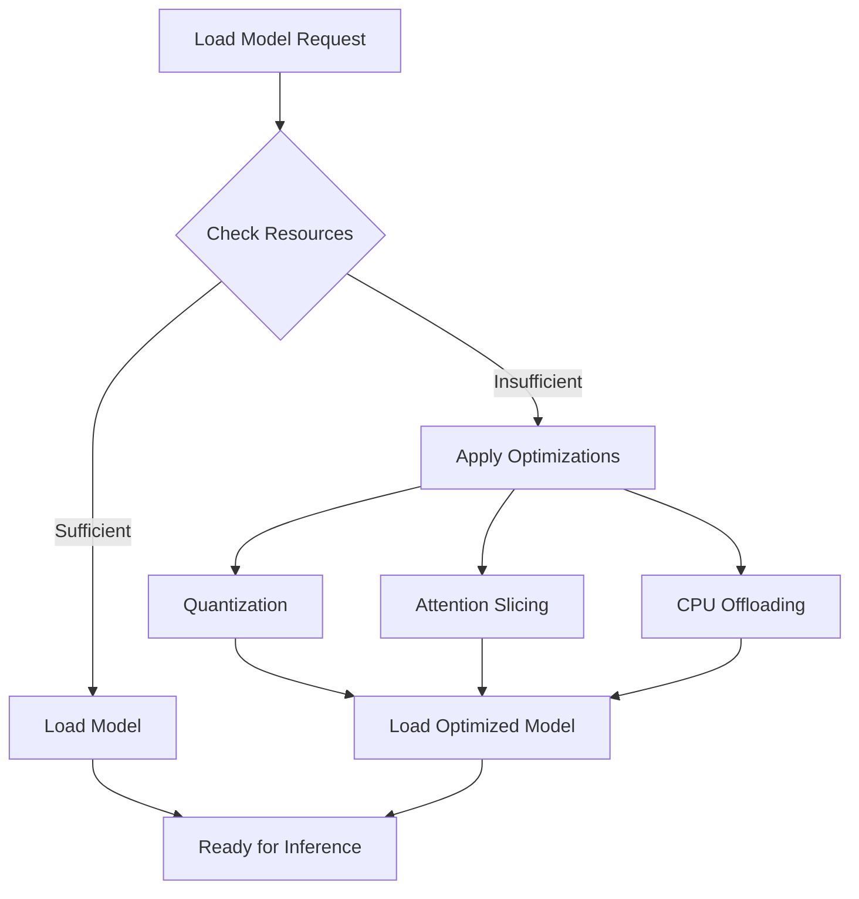
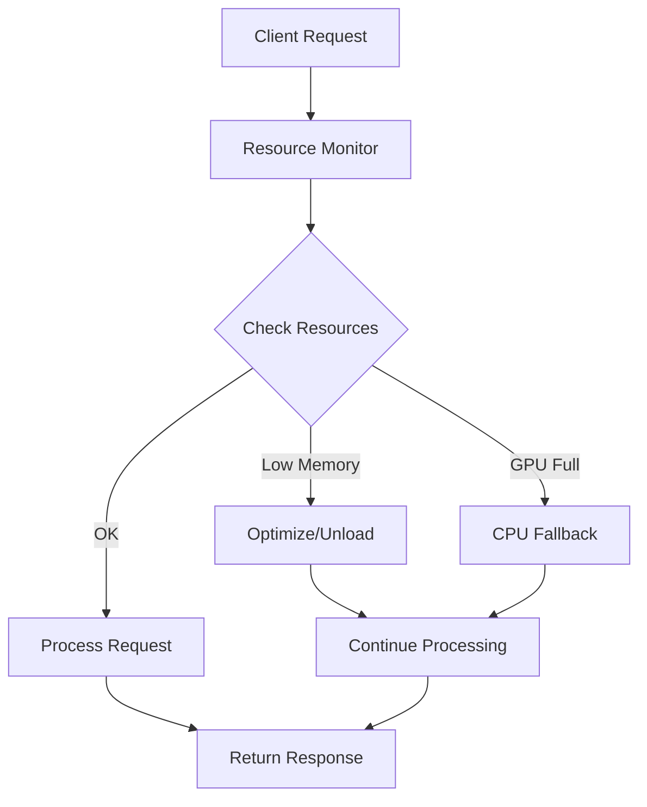
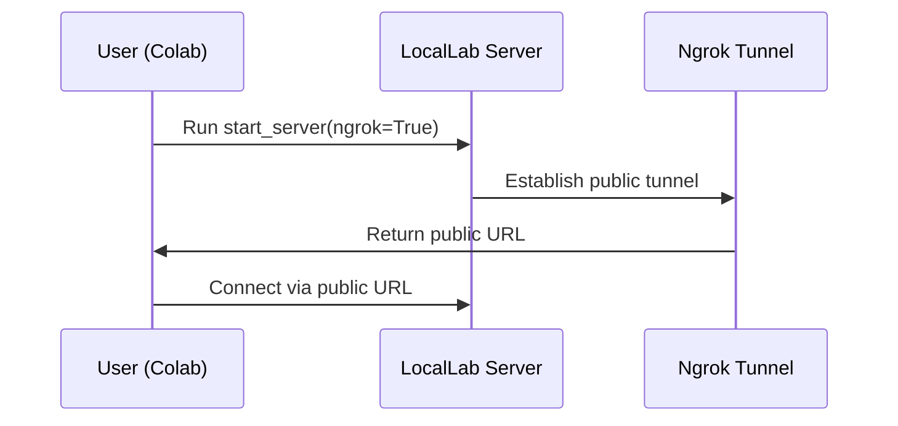

# 🚀 LocalLab

[](https://github.com/Developer-Utkarsh/LocalLab/actions)
[](https://coveralls.io/github/Developer-Utkarsh/LocalLab?branch=main)
[](https://pypi.org/project/locallab/)
[](https://pypi.org/project/locallab/)
[](https://github.com/Developer-Utkarsh/LocalLab/blob/main/LICENSE)

LocalLab is a powerful, lightweight AI inference server designed to deliver cutting-edge language model capabilities on your local machine or through Google Colab. It empowers developers and researchers to run sophisticated AI models on local hardware, optimizing resources with advanced features such as dynamic model loading, memory optimizations, and real-time system monitoring.

## What Problem Does LocalLab Solve?

- **Local Inference:** Run advanced language models without relying on expensive cloud services.
- **Optimized Performance:** Utilize state-of-the-art techniques like quantization, attention slicing, and CPU offloading for maximum efficiency.
- **Seamless Deployment:** Easily switch between local deployment and Google Colab, leveraging ngrok for public accessibility.
- **Effective Resource Management:** Automatically monitor and manage CPU, RAM, and GPU usage to ensure smooth operation.

## System Requirements

### Minimum Requirements

| Component | Local Deployment | Google Colab           |
| --------- | ---------------- | ---------------------- |
| RAM       | 4GB              | Free tier (12GB)       |
| CPU       | 2 cores          | 2 cores                |
| Python    | 3.8+             | 3.8+                   |
| Storage   | 2GB free         | -                      |
| GPU       | Optional         | Available in free tier |

### Recommended Requirements

| Component | Local Deployment | Google Colab       |
| --------- | ---------------- | ------------------ |
| RAM       | 8GB+             | Pro tier (24GB)    |
| CPU       | 4+ cores         | Pro tier (4 cores) |
| Python    | 3.9+             | 3.9+               |
| Storage   | 5GB+ free        | -                  |
| GPU       | CUDA-compatible  | Pro tier GPU       |

## Key Features

- **Multiple Model Support:** Pre-configured models along with the ability to load custom ones on demand.
- **Advanced Optimizations:** Support for FP16, INT8, and INT4 quantization, Flash Attention, and attention slicing.
- **Robust Resource Monitoring:** Real-time insights into system performance and resource usage.
- **Flexible Client Libraries:** Comprehensive clients available for both Python and Node.js.
- **Google Colab Friendly:** Dedicated workflow for deploying via Google Colab with public URL access.

## Architecture Overview

Below is an illustration of LocalLab's architecture:

```mermaid
graph TD;
    A[User] --> B[LocalLab Client (Python and Node.js)];
    B --> C[LocalLab Server];
    C --> D[Model Manager];
    D --> E[Hugging Face Models];
    C --> F[Optimizations];
    C --> G[Resource Monitoring];
```

### Model Loading & Optimization Flow



### Resource Management Flow



## Google Colab Workflow

When deploying on Google Colab, LocalLab uses ngrok to create a public tunnel. The workflow is depicted below:



## Documentation

📚 [Read the full documentation](https://github.com/Developer-Utkarsh/LocalLab/blob/main/docs/README.md)

- [Getting Started Guide](https://github.com/Developer-Utkarsh/LocalLab/blob/main/docs/guides/getting-started.md)
- [Python Client](https://github.com/Developer-Utkarsh/LocalLab/blob/main/docs/clients/python/README.md)
- [Node.js Client](https://github.com/Developer-Utkarsh/LocalLab/blob/main/docs/clients/nodejs/README.md)
- [Client Comparison](https://github.com/Developer-Utkarsh/LocalLab/blob/main/docs/clients/comparison.md)
- [Google Colab Guide](https://github.com/Developer-Utkarsh/LocalLab/blob/main/docs/colab/README.md)
- [API Reference](https://github.com/Developer-Utkarsh/LocalLab/blob/main/docs/guides/api.md)

## Usage Guides

- Detailed setup and usage instructions can be found in our [Documentation](https://github.com/Developer-Utkarsh/LocalLab/blob/main/docs/README.md).
- For Python-specific details, check out our [Python Client Guide](https://github.com/Developer-Utkarsh/LocalLab/blob/main/docs/clients/python.md).
- For Node.js-specific details, refer to our [Node.js Client Guide](https://github.com/Developer-Utkarsh/LocalLab/blob/main/docs/clients/nodejs.md).

## Get Started

1. **Installation:**

   ```bash
   pip install locallab
   ```

2. **Starting the Server Locally:**

   ```python
   from locallab import start_server
   start_server()
   ```

3. **Starting the Server on Google Colab:**

   ```python
   !pip install locallab
   import os
   os.environ["NGROK_AUTH_TOKEN"] = "your_token_here"
   from locallab import start_server
   start_server(ngrok=True)
   ```

4. **Connecting your Client:**
   ```python
   from locallab.client import LocalLabClient
   client = LocalLabClient("http://localhost:8000")  # Use ngrok URL for Colab deployment
   ```

## Join the Community

- Report issues on our [GitHub Issues](https://github.com/Developer-Utkarsh/LocalLab/issues).
- Participate in discussions on our [Community Forum](https://github.com/Developer-Utkarsh/LocalLab/discussions).
- Learn how to contribute by reading our [Contributing Guidelines](https://github.com/Developer-Utkarsh/LocalLab/blob/main/docs/guides/contributing.md).

---

LocalLab is designed to bring the power of advanced language models directly to your workspace—efficiently, flexibly, and affordably. Give it a try and revolutionize your AI projects!
