# memories.dev

<div align="center">

**Building the World's Memory for Artificial General Intelligence**

[](https://memories-dev.readthedocs.io/index.html)
[](LICENSE)
[](https://www.python.org/downloads/)
[](https://github.com/psf/black)
[](https://github.com/Vortx-AI/memories-dev/releases/tag/v2.0.1)
[](https://discord.com/invite/7qAFEekp)

<a href="https://www.producthunt.com/posts/memories-dev?embed=true&utm_source=badge-featured&utm_medium=badge&utm_souce=badge-memories&#0045;dev" target="_blank"></a>

</div>

## 🌟 Overview

memories.dev is a groundbreaking memory infrastructure designed to provide real-world contextual intelligence to AI models during inference. By processing, indexing, and serving location-tagged intelligence ("memories") from diverse data sources including satellite imagery, climate sensors, and urban development metrics, it creates a rich tapestry of environmental and spatial context that enhances AI models' understanding and reasoning capabilities.

### 🚀 Key Features

- **Multi-Modal Memory Formation**: 
  - Seamless integration of satellite imagery
  - Real-time environmental sensor data
  - Urban development metrics
  - Comprehensive spatial context

- **Temporal-Spatial Intelligence**: 
  - Advanced temporal data processing
  - Sophisticated spatial indexing
  - Real-time context updates
  - Historical data analysis

- **Advanced Model Integration**: 
  - Native DeepSeek support
  - Custom model implementation
  - Flexible API integration
  - Optimized inference pipeline

- **Enterprise-Grade Architecture**: 
  - High-performance processing
  - Scalable memory formation
  - Robust error handling
  - Comprehensive monitoring

- **Developer-First Design**: 
  - Intuitive API design
  - Extensive documentation
  - Active community support
  - Regular feature updates

## System Architecture

The system is built on three core pillars:

1. **Memory Formation Pipeline**: Processes raw data into structured memories
2. **Query Pipeline**: Efficient retrieval and context assembly
3. **Agent System**: Intelligent reasoning and synthesis

## Quick Start

```python
from memories.models.load_model import LoadModel
from memories.core.memory import MemoryStore
from memories.agents.agent import Agent


# Initialize with advanced models
load_model = LoadModel(
    use_gpu= True 
    model_provider= "deepseek-ai" #"deepseek" or "openai"
    deployment_type= "local" #"local" or "api"
    model_name= "deepseek-r1-zero" #"deepseek-r1-zero" or "gpt-4o" or "deepseek-coder-3.1b-base" or "gpt-4o-mini"
    #api_key= #"your-api-key" optional for api deployment
)

# Create Earth memories
memory_store = MemoryStore()

memories = memory_store.create_memories(
    model = load_model,
    location=(37.7749, -122.4194),  # San Francisco coordinates
    time_range=("2024-01-01", "2024-02-01"),
    artifacts={
        "satellite": ["sentinel-2", "landsat8"],
        "landuse": ["osm","overture"]
    }
)


# Generate synthetic data
synthetic_data = vx.generate_synthetic(
    base_location=(37.7749, -122.4194),
    scenario="urban_development",
    time_steps=10,
    climate_factors=True
)

# AGI reasoning with memories
insights = Agent(
    query="Analyze urban development patterns and environmental impact",
    context_memories=memories,
    synthetic_scenarios=synthetic_data
)
```

## 🛠️ Installation

### System Requirements

- **Python**: 3.9 - 3.13
- **OS**: Linux, macOS, Windows
- **Memory**: 8GB RAM (minimum), 16GB+ (recommended)
- **Storage**: 10GB+ available space
- **GPU**: Optional, but recommended for optimal performance

### Basic Installation

```bash
pip install memories-dev
```

### Python Version Compatibility

The package supports Python versions 3.9 through 3.13. Dependencies are automatically adjusted based on your Python version to ensure compatibility.

### Installation Options

#### 1. CPU-only Installation (Default)
```bash
pip install memories-dev
```

#### 2. GPU Support Installation
For CUDA 11.8:
```bash
pip install memories-dev[gpu]
```

For different CUDA versions, install PyTorch manually first:
```bash
# For CUDA 12.1
pip install torch torchvision torchaudio --index-url https://download.pytorch.org/whl/cu121

# Then install the package
pip install memories-dev[gpu]
```

#### 3. Development Installation
For contributing to the project:
```bash
pip install memories-dev[dev]
```

#### 4. Documentation Tools
For building documentation:
```bash
pip install memories-dev[docs]
```

### Version-specific Dependencies

The package automatically handles version-specific dependencies based on your Python version:

- Python 3.9: Compatible with older versions of key packages
- Python 3.10-3.11: Standard modern package versions
- Python 3.12-3.13: Latest package versions with improved performance

### Common Issues and Solutions

1. **Shapely Version Conflicts**
   - For Python <3.13: Uses Shapely 1.7.0-1.8.5
   - For Python ≥3.13: Uses Shapely 2.0+

2. **GPU Dependencies**
   - CUDA toolkit must be installed separately
   - PyTorch Geometric packages are installed from wheels matching your CUDA version

3. **Package Conflicts**
   If you encounter dependency conflicts:
   ```bash
   pip install --upgrade pip
   pip install memories-dev --no-deps
   pip install -r requirements.txt
   ```

### Development Setup

1. Clone the repository:
```bash
git clone https://github.com/Vortx-AI/memories-dev.git
cd memories-dev
```

2. Create a virtual environment:
```bash
python -m venv venv
source venv/bin/activate  # Linux/Mac
# or
.\venv\Scripts\activate  # Windows
```

3. Install development dependencies:
```bash
pip install -e .[dev]
```

4. Install pre-commit hooks:
```bash
pre-commit install
```

## 🔄 Workflows

### Memory Formation Pipeline

```mermaid
graph LR
    %% Node Styles
    classDef input fill:#e3f2fd,stroke:#1565c0,stroke-width:2px
    classDef process fill:#f3e5f5,stroke:#6a1b9a,stroke-width:2px
    classDef storage fill:#e8f5e9,stroke:#2e7d32,stroke-width:2px
    
    %% Input Nodes
    I1(("📡 Raw Data")):::input
    I2(("🛰️ Satellite")):::input
    I3(("🌡️ Sensors")):::input
    
    %% Processing Nodes
    P1["🔄 Preprocessing"]:::process
    P2["⚡ Feature Extraction"]:::process
    P3["🧠 Memory Formation"]:::process
    
    %% Storage Nodes
    S1[("💾 Vector Store")]:::storage
    S2[("📊 Time Series DB")]:::storage
    S3[("🗺️ Spatial Index")]:::storage
    
    %% Flow
    I1 & I2 & I3 --> P1
    P1 --> P2
    P2 --> P3
    P3 --> S1 & S2 & S3
```



### Query Pipeline

```mermaid
graph TD
    %% Node Styles
    classDef query fill:#fff3e0,stroke:#e65100,stroke-width:2px
    classDef memory fill:#f3e5f5,stroke:#6a1b9a,stroke-width:2px
    classDef output fill:#e8f5e9,stroke:#2e7d32,stroke-width:2px

    %% Query Flow
    Q1["🔍 Query Request"]:::query
    Q2["📍 Location Filter"]:::query
    Q3["⏱️ Time Filter"]:::query
    
    %% Memory Operations
    M1["🧠 Memory Lookup"]:::memory
    M2["🔄 Context Assembly"]:::memory
    M3["⚡ Real-time Update"]:::memory
    
    %% Output Generation
    O1["📊 Results"]:::output
    O2["📝 Analysis"]:::output
    O3["🔄 Synthesis"]:::output

    %% Connections
    Q1 --> Q2 & Q3
    Q2 & Q3 --> M1
    M1 --> M2 --> M3
    M3 --> O1 & O2 & O3
```




### Agent System

```mermaid
graph TD
    %% Node Styles
    classDef agent fill:#fff3e0,stroke:#e65100,stroke-width:2px
    classDef memory fill:#f3e5f5,stroke:#6a1b9a,stroke-width:2px
    classDef task fill:#e3f2fd,stroke:#1565c0,stroke-width:2px

    %% Agent Components
    subgraph "🤖 Agent System"
        A1["🧠 Reasoning Engine"]:::agent
        A2["🔄 Memory Integration"]:::agent
        A3["📊 Analysis Engine"]:::agent
    end

    %% Memory Access
    subgraph "💾 Memory Access"
        M1["📥 Retrieval"]:::memory
        M2["🔄 Update"]:::memory
        M3["🔍 Query"]:::memory
    end

    %% Task Processing
    subgraph "📋 Tasks"
        T1["📊 Analysis"]:::task
        T2["🔄 Synthesis"]:::task
        T3["📝 Reporting"]:::task
    end

    %% Connections
    A1 --> M1 & M2 & M3
    M1 & M2 & M3 --> A2
    A2 --> A3
    A3 --> T1 & T2 & T3
```



### Memory Architecture


### Data Flow


## 📚 Module Dependencies

```mermaid
graph TD
    %% Node Styles
    classDef core fill:#e3f2fd,stroke:#1565c0,stroke-width:2px
    classDef dep fill:#fff3e0,stroke:#e65100,stroke-width:2px
    classDef util fill:#f3e5f5,stroke:#6a1b9a,stroke-width:2px

    %% Core Modules
    C1["🧠 Memory Core"]:::core
    C2["🤖 Agent Core"]:::core
    C3["📡 Data Core"]:::core

    %% Dependencies
    D1["📊 NumPy/Pandas"]:::dep
    D2["🔥 PyTorch"]:::dep
    D3["🗄️ Vector Store"]:::dep
    D4["🌐 Network Utils"]:::dep

    %% Utilities
    U1["⚙️ Config"]:::util
    U2["📝 Logging"]:::util
    U3["✅ Validation"]:::util

    %% Connections
    D1 & D2 --> C1
    D3 --> C1 & C2
    D4 --> C3
    U1 --> C1 & C2 & C3
    U2 --> C1 & C2 & C3
    U3 --> C1 & C2 & C3
```



## Usage

See our [documentation](https://docs.memories.dev) for detailed usage instructions and examples.

## License

This project is licensed under the Apache License 2.0 - see the [LICENSE](LICENSE) file for details.

## Contributing

We welcome contributions! Here's how you can help:

1. **Bug Reports**: Open an issue with a clear description and reproduction steps
2. **Feature Requests**: Use the issue tracker to propose new features
3. **Code Contributions**: Submit pull requests with tests and documentation
4. **Documentation**: Help improve our docs and examples

See our [Contributing Guide](CONTRIBUTING.md) for more details.

## Community

- Join our [Discord community](https://discord.com/invite/7qAFEekp) for discussions
- Follow our [Blog](https://memories.dev/blog) for updates and tutorials
- Check out our [Examples Gallery](https://memories.dev/examples)

## Citation

If you use memories.dev in your research, please cite:

```bibtex
@software{memories_dev_2024,
  title={memories.dev: Collective Memory Infrastructure for AGI},
  author={Vortx AI Team},
  year={2024},
  url={https://github.com/Vortx-AI/memories-dev}
}
```

## Advanced Usage

### Memory Formation with Custom Sources

```python
from memories.core.memory import MemoryStore
from memories.data_acquisition.sources import CustomSource

# Initialize with custom data source
memory_store = MemoryStore()
custom_source = CustomSource(
    data_type="environmental",
    update_frequency="1h"
)

# Create specialized memories
memories = memory_store.create_memories(
    sources=[custom_source],
    location_bounds={
        "min_lat": 37.7,
        "max_lat": 37.8,
        "min_lon": -122.5,
        "max_lon": -122.4
    },
    temporal_range={
        "start": "2024-01-01",
        "end": "2024-02-01"
    }
)
```

### Advanced Query Patterns

```python
# Complex spatial-temporal query
results = memory_store.query(
    location=(37.7749, -122.4194),
    radius=5000,  # meters
    time_range=("2024-01-01", "2024-02-01"),
    data_types=["satellite", "environmental"],
    aggregation="hourly"
)

# Memory synthesis
synthesis = memory_store.synthesize(
    memories=results,
    context="urban development impact",
    temporal_resolution="daily"
)
```

---

<div align="center">

**Empowering AGI with Real-World Context**

<p align="center">Built with 💜 by the memories.dev team</p>

<p align="center">
<a href="https://discord.com/invite/7qAFEekp">Discord</a> •
<a href="https://memories.dev/blog">Blog</a> •
<a href="https://memories.dev/examples">Examples</a>
</p>

</div>

