# 🌍 memories-dev

<div align="center">


**Building the World's Memory for Artificial General Intelligence**

[](https://memories-dev.readthedocs.io/index.html)
[](LICENSE)
[](https://www.python.org/downloads/)
[](https://github.com/psf/black)
[](https://github.com/Vortx-AI/memories-dev/releases/tag/v2.0.2)
[](https://discord.gg/tGCVySkX4d)

<a href="https://www.producthunt.com/posts/memories-dev?embed=true&utm_source=badge-featured&utm_medium=badge&utm_souce=badge-memories&#0045;dev" target="_blank"></a>

</div>

> **"The framework that gives AI systems a memory of the physical world."**

## 🚀 What is memories-dev?

**memories-dev** is a groundbreaking Python framework that creates a collective memory system for AI by integrating satellite imagery, geospatial data, and environmental metrics with large language models. It provides foundation models with unprecedented contextual understanding of the physical world through a sophisticated Earth Memory system.

```mermaid
%%{init: {'theme': 'forest', 'themeVariables': { 'primaryColor': '#1f77b4', 'primaryTextColor': '#fff', 'primaryBorderColor': '#0d6efd', 'lineColor': '#3498db', 'secondaryColor': '#16a085', 'tertiaryColor': '#2980b9'}}}%%
graph TD
    classDef foundationModels fill:#3498db,stroke:#2980b9,stroke-width:2px,color:white,font-weight:bold
    classDef earthMemory fill:#16a085,stroke:#1abc9c,stroke-width:2px,color:white,font-weight:bold
    classDef contextNodes fill:#9b59b6,stroke:#8e44ad,stroke-width:2px,color:white
    classDef intelligenceNodes fill:#f39c12,stroke:#f1c40f,stroke-width:2px,color:white
    classDef memoryNode fill:#e74c3c,stroke:#c0392b,stroke-width:2px,color:white,font-weight:bold
    classDef appNode fill:#2c3e50,stroke:#34495e,stroke-width:2px,color:white,font-weight:bold
    
    A[🤖 Foundation Models] -->|Augmented with| B[🌍 Earth Memory]
    B -->|Provides| C[📍 Spatial Context]
    B -->|Provides| D[⏱️ Temporal Context]
    B -->|Provides| E[🌱 Environmental Context]
    C -->|Enables| F[📌 Location-Aware Intelligence]
    D -->|Enables| G[⏰ Time-Aware Intelligence]
    E -->|Enables| H[🌿 Environment-Aware Intelligence]
    F --> I[🧠 Collective AGI Memory]
    G --> I
    H --> I
    I -->|Powers| J[🚀 Next-Gen AI Applications]
    
    A:::foundationModels
    B:::earthMemory
    C:::contextNodes
    D:::contextNodes
    E:::contextNodes
    F:::intelligenceNodes
    G:::intelligenceNodes
    H:::intelligenceNodes
    I:::memoryNode
    J:::appNode

    linkStyle 0 stroke:#3498db,stroke-width:2px,stroke-dasharray: 5 5
    linkStyle 1,2,3 stroke:#16a085,stroke-width:2px
    linkStyle 4,5,6 stroke:#9b59b6,stroke-width:2px
```

<div align="center">
  
</div>




## 🚀 What's New in Version 2.0.2

- **Enhanced Earth Memory Integration**: Seamless fusion of 15+ specialized analyzers for comprehensive environmental understanding
- **Temporal Analysis Engine**: Advanced historical change detection and future prediction capabilities
- **Asynchronous Processing Pipeline**: Parallel execution of multiple Earth Memory analyzers for 10x faster analysis
- **Vector-Based Memory Storage**: Efficient embedding and retrieval of complex multi-modal data
- **Comprehensive Scoring System**: Sophisticated algorithms for property evaluation across multiple dimensions
- **Multi-model Inference**: Compare results from multiple LLM providers
- **Streaming Responses**: Real-time streaming for all supported model providers
- **Memory Optimization**: Advanced memory usage with automatic tier balancing
- **Distributed Memory**: Support for distributed memory across multiple nodes

## 🌟 Why memories-dev?

### The Problem: AI Systems Lack Physical World Context

Current AI systems have limited understanding of the physical world:
- They can't access or interpret geospatial data effectively
- They lack temporal understanding of how places change over time
- They can't integrate environmental factors into their reasoning
- They have no memory of physical locations or their characteristics

### The Solution: Earth Memory Integration

memories-dev solves these problems by:
- Creating a sophisticated memory system that integrates 15+ specialized Earth analyzers
- Providing asynchronous parallel processing of multiple data sources
- Enabling temporal analysis for historical change detection and future prediction
- Implementing a tiered memory architecture for efficient data management
- Offering a comprehensive API for seamless integration with AI systems

## 💡 Key Features

### 1. Multi-Modal Earth Memory Integration

memories-dev creates a sophisticated memory system by fusing multiple data sources:

```mermaid
%%{init: {'theme': 'forest', 'themeVariables': { 'primaryColor': '#2c3e50', 'primaryTextColor': '#ecf0f1', 'primaryBorderColor': '#34495e', 'lineColor': '#3498db', 'secondaryColor': '#16a085', 'tertiaryColor': '#2980b9'}}}%%
graph LR
    classDef mainSystem fill:#2c3e50,stroke:#34495e,stroke-width:2px,color:white,font-weight:bold
    classDef satelliteData fill:#3498db,stroke:#2980b9,stroke-width:2px,color:white
    classDef vectorData fill:#9b59b6,stroke:#8e44ad,stroke-width:2px,color:white
    classDef environmentalData fill:#16a085,stroke:#1abc9c,stroke-width:2px,color:white
    classDef temporalData fill:#f39c12,stroke:#f1c40f,stroke-width:2px,color:white
    classDef climateData fill:#e74c3c,stroke:#c0392b,stroke-width:2px,color:white
    classDef urbanData fill:#1abc9c,stroke:#16a085,stroke-width:2px,color:white
    classDef dataSource fill:#7f8c8d,stroke:#95a5a6,stroke-width:1px,color:white
    
    A[🌍 Earth Memory System] --> B[🛰️ Satellite Imagery]
    A --> C[🗺️ Vector Geospatial Data]
    A --> D[🌱 Environmental Metrics]
    A --> E[⏱️ Temporal Analysis]
    A --> F[🌡️ Climate Data]
    A --> G[🏙️ Urban Development]
    
    B --> H[📡 Sentinel-2]
    B --> I[📡 Landsat]
    B --> J[🌐 Earth Engine]
    
    C --> K[🗺️ Overture Maps]
    C --> L[🗺️ OpenStreetMap]
    C --> M[🔄 WFS Services]
    
    D --> N[💨 Air Quality]
    D --> O[🦋 Biodiversity]
    D --> P[🔊 Noise Levels]
    D --> Q[☀️ Solar Potential]
    
    E --> R[📜 Historical Changes]
    E --> S[🔮 Future Predictions]
    
    F --> T[🌡️ Climate Data]
    F --> U[🌧️ Precipitation Patterns]
    F --> V[⚠️ Extreme Weather Risk]
    
    G --> W[🏢 Urban Density]
    G --> X[🛣️ Infrastructure]
    G --> Y[📋 Development Plans]
    
    A:::mainSystem
    B:::satelliteData
    C:::vectorData
    D:::environmentalData
    E:::temporalData
    F:::climateData
    G:::urbanData
    H:::dataSource
    I:::dataSource
    J:::dataSource
    K:::dataSource
    L:::dataSource
    M:::dataSource
    N:::dataSource
    O:::dataSource
    P:::dataSource
    Q:::dataSource
    R:::dataSource
    S:::dataSource
    T:::dataSource
    U:::dataSource
    V:::dataSource
    W:::dataSource
    X:::dataSource
    Y:::dataSource
    
    linkStyle 0,1,2,3,4,5 stroke-width:2px
    linkStyle 0 stroke:#3498db
    linkStyle 1 stroke:#9b59b6
    linkStyle 2 stroke:#16a085
    linkStyle 3 stroke:#f39c12
    linkStyle 4 stroke:#e74c3c
    linkStyle 5 stroke:#1abc9c
```



### 2. Specialized Earth Memory Analyzers

The framework includes 15+ specialized analyzers for extracting insights from Earth Memory:

```mermaid
%%{init: {'theme': 'base', 'themeVariables': { 'primaryColor': '#1e293b', 'primaryTextColor': '#f8fafc', 'primaryBorderColor': '#334155', 'lineColor': '#3b82f6', 'secondaryColor': '#10b981', 'tertiaryColor': '#6366f1'}}}%%
graph TD
    classDef mainSystem fill:#1e293b,stroke:#334155,stroke-width:2px,color:white,font-weight:bold
    classDef terrainAnalyzer fill:#3b82f6,stroke:#2563eb,stroke-width:2px,color:white,font-weight:bold
    classDef climateAnalyzer fill:#ef4444,stroke:#dc2626,stroke-width:2px,color:white,font-weight:bold
    classDef environmentalAnalyzer fill:#10b981,stroke:#059669,stroke-width:2px,color:white,font-weight:bold
    classDef landAnalyzer fill:#8b5cf6,stroke:#7c3aed,stroke-width:2px,color:white,font-weight:bold
    classDef waterAnalyzer fill:#0ea5e9,stroke:#0284c7,stroke-width:2px,color:white,font-weight:bold
    classDef geologicalAnalyzer fill:#f59e0b,stroke:#d97706,stroke-width:2px,color:white,font-weight:bold
    classDef urbanAnalyzer fill:#6366f1,stroke:#4f46e5,stroke-width:2px,color:white,font-weight:bold
    classDef bioAnalyzer fill:#84cc16,stroke:#65a30d,stroke-width:2px,color:white,font-weight:bold
    classDef airAnalyzer fill:#06b6d4,stroke:#0891b2,stroke-width:2px,color:white,font-weight:bold
    classDef noiseAnalyzer fill:#ec4899,stroke:#db2777,stroke-width:2px,color:white,font-weight:bold
    classDef solarAnalyzer fill:#eab308,stroke:#ca8a04,stroke-width:2px,color:white,font-weight:bold
    classDef walkAnalyzer fill:#14b8a6,stroke:#0d9488,stroke-width:2px,color:white,font-weight:bold
    classDef viewAnalyzer fill:#8b5cf6,stroke:#7c3aed,stroke-width:2px,color:white,font-weight:bold
    classDef microAnalyzer fill:#22c55e,stroke:#16a34a,stroke-width:2px,color:white,font-weight:bold
    classDef propertyAnalyzer fill:#f43f5e,stroke:#e11d48,stroke-width:2px,color:white,font-weight:bold
    classDef infraAnalyzer fill:#6366f1,stroke:#4f46e5,stroke-width:2px,color:white,font-weight:bold
    classDef subAnalyzer fill:#64748b,stroke:#475569,stroke-width:1px,color:white
    
    A[🧠 Earth Memory Analyzers] --> B[🏔️ TerrainAnalyzer]
    A --> C[🌡️ ClimateDataFetcher]
    A --> D[🌱 EnvironmentalImpactAnalyzer]
    A --> E[🏞️ LandUseClassifier]
    A --> F[💧 WaterResourceAnalyzer]
    A --> G[🪨 GeologicalDataFetcher]
    A --> H[🏙️ UrbanDevelopmentAnalyzer]
    A --> I[🦋 BiodiversityAnalyzer]
    A --> J[💨 AirQualityMonitor]
    A --> K[🔊 NoiseAnalyzer]
    A --> L[☀️ SolarPotentialCalculator]
    A --> M[🚶 WalkabilityAnalyzer]
    A --> N[👁️ ViewshedAnalyzer]
    A --> O[🌤️ MicroclimateAnalyzer]
    A --> P[💰 PropertyValuePredictor]
    A --> Q[🛣️ InfrastructureAnalyzer]
    
    B --> B1[📏 Elevation Analysis]
    B --> B2[📐 Slope Analysis]
    B --> B3[🧭 Aspect Analysis]
    B --> B4[⚠️ Landslide Risk]
    
    C --> C1[📈 Temperature Trends]
    C --> C2[🌧️ Precipitation Patterns]
    C --> C3[🔮 Climate Projections]
    C --> C4[🌪️ Extreme Weather Risk]
    
    F --> F1[🌊 Flood Risk Assessment]
    F --> F2[🧪 Water Quality Analysis]
    F --> F3[🏜️ Drought Risk Modeling]
    F --> F4[🏞️ Watershed Analysis]
    
    H --> H1[📊 Urban Growth Patterns]
    H --> H2[📋 Development Plans]
    H --> H3[🏗️ Infrastructure Analysis]
    H --> H4[🏢 Zoning Changes]
    
    A:::mainSystem
    B:::terrainAnalyzer
    C:::climateAnalyzer
    D:::environmentalAnalyzer
    E:::landAnalyzer
    F:::waterAnalyzer
    G:::geologicalAnalyzer
    H:::urbanAnalyzer
    I:::bioAnalyzer
    J:::airAnalyzer
    K:::noiseAnalyzer
    L:::solarAnalyzer
    M:::walkAnalyzer
    N:::viewAnalyzer
    O:::microAnalyzer
    P:::propertyAnalyzer
    Q:::infraAnalyzer
    
    B1:::subAnalyzer
    B2:::subAnalyzer
    B3:::subAnalyzer
    B4:::subAnalyzer
    C1:::subAnalyzer
    C2:::subAnalyzer
    C3:::subAnalyzer
    C4:::subAnalyzer
    F1:::subAnalyzer
    F2:::subAnalyzer
    F3:::subAnalyzer
    F4:::subAnalyzer
    H1:::subAnalyzer
    H2:::subAnalyzer
    H3:::subAnalyzer
    H4:::subAnalyzer
    
    linkStyle 0,1,2,3,4,5,6,7,8,9,10,11,12,13,14,15 stroke-width:2px,stroke-dasharray:5 5
```



### 3. Tiered Memory Architecture

Our sophisticated memory management system optimizes data storage and retrieval:

```python
from memories import MemoryStore, Config

# Configure tiered memory architecture
config = Config(
    storage_path="./data",
    hot_memory_size=50,    # MB - Fast access, frequently used data
    warm_memory_size=200,  # MB - Balanced storage for semi-active data
    cold_memory_size=1000  # MB - Efficient storage for historical data
)

# Initialize memory store with automatic tier management
memory_store = MemoryStore(config)

# Store data with explicit tier assignment
await memory_store.store(
    "property_analysis_37.7749_-122.4194",
    analysis_result,
    tier="hot",  # Options: "hot", "warm", "cold"
    metadata={
        "location": {"lat": 37.7749, "lon": -122.4194},
        "timestamp": "2025-02-15T10:30:00Z",
        "analysis_type": "comprehensive_property"
    }
)
```

### 4. Asynchronous Parallel Processing

The framework uses advanced asynchronous processing to fetch and analyze multiple data sources in parallel:

```python
async def _fetch_comprehensive_earth_data(
    self,
    location: Point,
    area: Polygon
) -> Dict[str, Any]:
    """Fetch comprehensive earth memory data for the property location."""
    tasks = [
        self._fetch_sentinel_data(location, area),
        self._fetch_overture_data(location, area),
        terrain_analyzer.analyze_terrain(area),
        climate_fetcher.get_climate_data(area),
        impact_analyzer.analyze_environmental_impact(area),
        water_analyzer.analyze_water_resources(area),
        geological_fetcher.get_geological_data(area),
        urban_analyzer.analyze_urban_development(area),
        biodiversity_analyzer.analyze_biodiversity(area),
        air_quality_monitor.get_air_quality(location),
        noise_analyzer.analyze_noise_levels(area),
        solar_calculator.calculate_solar_potential(area),
        walkability_analyzer.analyze_walkability(location)
    ]
    
    results = await asyncio.gather(*tasks)
    
    return {
        "sentinel_data": results[0],
        "overture_data": results[1],
        "terrain_data": results[2],
        "climate_data": results[3],
        "environmental_impact": results[4],
        "water_resources": results[5],
        "geological_data": results[6],
        "urban_development": results[7],
        "biodiversity": results[8],
        "air_quality": results[9],
        "noise_levels": results[10],
        "solar_potential": results[11],
        "walkability": results[12]
    }
```

### 5. Multi-Dimensional Property Analysis

Our `RealEstateAgent` example demonstrates how memories-dev enables sophisticated property analysis:

```python
async def _analyze_current_conditions(
    self,
    location: Point,
    area: Polygon,
    earth_data: Dict[str, Any]
) -> Dict[str, Any]:
    """Analyze current property conditions using earth memory data."""
    return {
        "environmental_quality": {
            "air_quality_index": earth_data["air_quality"]["aqi"],
            "noise_level_db": earth_data["noise_levels"]["average_db"],
            "green_space_ratio": earth_data["environmental_impact"]["green_space_ratio"],
            "biodiversity_score": earth_data["biodiversity"]["biodiversity_index"]
        },
        "natural_risks": {
            "flood_risk": earth_data["water_resources"]["flood_risk_score"],
            "earthquake_risk": earth_data["geological_data"]["seismic_risk_score"],
            "landslide_risk": earth_data["terrain_data"]["landslide_risk_score"],
            "subsidence_risk": earth_data["geological_data"]["subsidence_risk_score"]
        },
        "urban_features": {
            "walkability_score": earth_data["walkability"]["score"],
            "public_transport_access": earth_data["urban_development"]["transit_score"],
            "amenities_score": earth_data["overture_data"]["amenities_score"],
            "urban_density": earth_data["urban_development"]["density_score"]
        },
        "sustainability": {
            "solar_potential": earth_data["solar_potential"]["annual_kwh"],
            "green_building_score": earth_data["environmental_impact"]["building_sustainability"],
            "water_efficiency": earth_data["water_resources"]["efficiency_score"],
            "energy_efficiency": earth_data["environmental_impact"]["energy_efficiency"]
        },
        "climate_resilience": {
            "heat_island_effect": earth_data["climate_data"]["heat_island_intensity"],
            "cooling_demand": earth_data["climate_data"]["cooling_degree_days"],
            "storm_resilience": earth_data["climate_data"]["storm_risk_score"],
            "drought_risk": earth_data["water_resources"]["drought_risk_score"]
        }
    }
```

### 6. Temporal Analysis Engine

The framework includes sophisticated temporal analysis capabilities for understanding how places change over time:

```python
async def _analyze_historical_changes(
    self,
    location: Point,
    area: Polygon
) -> Dict[str, Any]:
    """Analyze historical changes in the area over the specified time period."""
    end_date = datetime.now()
    start_date = end_date - timedelta(days=365 * self.temporal_analysis_years)
    
    # Fetch historical satellite imagery
    historical_imagery = await sentinel_client.get_historical_imagery(
        area,
        start_date,
        end_date,
        max_cloud_cover=20
    )
    
    # Analyze changes
    land_use_changes = await land_use_classifier.analyze_changes(historical_imagery)
    urban_development_changes = await urban_analyzer.analyze_historical_changes(area, start_date, end_date)
    environmental_changes = await impact_analyzer.analyze_historical_impact(area, start_date, end_date)
    climate_changes = await climate_fetcher.get_historical_trends(area, start_date, end_date)
    
    return {
        "land_use_changes": land_use_changes,
        "urban_development": urban_development_changes,
        "environmental_impact": environmental_changes,
        "climate_trends": climate_changes
    }
```

## 🏗️ Quick Start

```bash
# Install the framework with all dependencies
pip install memories-dev[all]

# Set up environment variables for Earth Memory access
export OVERTURE_API_KEY=your_api_key
export SENTINEL_USER=your_username
export SENTINEL_PASSWORD=your_password

# Run the Real Estate Agent example
python examples/real_estate_agent.py
```

## 🌐 Real-World Applications

memories-dev powers sophisticated AI applications with deep contextual understanding:

### 1. Real Estate Intelligence

Our `RealEstateAgent` class demonstrates comprehensive property analysis using Earth Memory:

```mermaid
%%{init: {'theme': 'base', 'themeVariables': { 'primaryColor': '#0f172a', 'primaryTextColor': '#f8fafc', 'primaryBorderColor': '#1e293b', 'lineColor': '#3b82f6', 'secondaryColor': '#10b981', 'tertiaryColor': '#6366f1'}}}%%
graph TD
    classDef inputData fill:#3b82f6,stroke:#2563eb,stroke-width:2px,color:white,font-weight:bold
    classDef memorySystem fill:#10b981,stroke:#059669,stroke-width:2px,color:white,font-weight:bold
    classDef agent fill:#6366f1,stroke:#4f46e5,stroke-width:2px,color:white,font-weight:bold
    classDef analysis fill:#0f172a,stroke:#1e293b,stroke-width:2px,color:white
    classDef environmental fill:#22c55e,stroke:#16a34a,stroke-width:2px,color:white
    classDef risks fill:#ef4444,stroke:#dc2626,stroke-width:2px,color:white
    classDef urban fill:#8b5cf6,stroke:#7c3aed,stroke-width:2px,color:white
    classDef sustainability fill:#10b981,stroke:#059669,stroke-width:2px,color:white
    classDef climate fill:#0ea5e9,stroke:#0284c7,stroke-width:2px,color:white
    classDef historical fill:#f59e0b,stroke:#d97706,stroke-width:2px,color:white
    classDef future fill:#ec4899,stroke:#db2777,stroke-width:2px,color:white
    classDef scores fill:#f43f5e,stroke:#e11d48,stroke-width:2px,color:white
    classDef metrics fill:#64748b,stroke:#475569,stroke-width:1px,color:white
    
    A[📊 Property Data] -->|Input| B[🏠 RealEstateAgent]
    C[🌍 Earth Memory System] -->|13 Specialized Analyzers| B
    B -->|Asynchronous Analysis| D[🔍 Comprehensive Property Analysis]
    
    D -->|Output| E[🌿 Environmental Quality]
    E -->|Metrics| E1[💨 Air Quality Index]
    E -->|Metrics| E2[🔊 Noise Levels]
    E -->|Metrics| E3[🌳 Green Space Ratio]
    E -->|Metrics| E4[🦋 Biodiversity Score]
    
    D -->|Output| F[⚠️ Natural Risks]
    F -->|Metrics| F1[🌊 Flood Risk]
    F -->|Metrics| F2[🌋 Earthquake Risk]
    F -->|Metrics| F3[⛰️ Landslide Risk]
    F -->|Metrics| F4[🕳️ Subsidence Risk]
    
    D -->|Output| G[🏙️ Urban Features]
    G -->|Metrics| G1[🚶 Walkability Score]
    G -->|Metrics| G2[🚇 Public Transport Access]
    G -->|Metrics| G3[🏬 Amenities Score]
    G -->|Metrics| G4[🏢 Urban Density]
    
    D -->|Output| H[♻️ Sustainability]
    H -->|Metrics| H1[☀️ Solar Potential]
    H -->|Metrics| H2[🏗️ Green Building Score]
    H -->|Metrics| H3[💧 Water Efficiency]
    H -->|Metrics| H4[⚡ Energy Efficiency]
    
    D -->|Output| I[🌡️ Climate Resilience]
    I -->|Metrics| I1[🔥 Heat Island Effect]
    I -->|Metrics| I2[❄️ Cooling Demand]
    I -->|Metrics| I3[🌪️ Storm Resilience]
    I -->|Metrics| I4[🏜️ Drought Risk]
    
    B -->|Temporal Analysis| J[📜 Historical Changes]
    J -->|Analysis| J1[🏞️ Land Use Changes]
    J -->|Analysis| J2[🏗️ Urban Development]
    J -->|Analysis| J3[🌱 Environmental Impact]
    J -->|Analysis| J4[🌡️ Climate Trends]
    
    B -->|Predictive Analysis| K[🔮 Future Predictions]
    K -->|Predictions| K1[🏙️ Urban Development]
    K -->|Predictions| K2[🌿 Environmental Changes]
    K -->|Predictions| K3[🌡️ Climate Projections]
    K -->|Predictions| K4[♻️ Sustainability Outlook]
    
    B -->|Multi-Dimensional Scoring| L[⭐ Property Scores]
    L -->|Score| L1[🏆 Overall Score]
    L -->|Score| L2[♻️ Sustainability Score]
    L -->|Score| L3[🏡 Livability Score]
    L -->|Score| L4[💰 Investment Score]
    L -->|Score| L5[🛡️ Resilience Score]
    
    A:::inputData
    B:::agent
    C:::memorySystem
    D:::analysis
    E:::environmental
    F:::risks
    G:::urban
    H:::sustainability
    I:::climate
    J:::historical
    K:::future
    L:::scores
    
    E1:::metrics
    E2:::metrics
    E3:::metrics
    E4:::metrics
    F1:::metrics
    F2:::metrics
    F3:::metrics
    F4:::metrics
    G1:::metrics
    G2:::metrics
    G3:::metrics
    G4:::metrics
    H1:::metrics
    H2:::metrics
    H3:::metrics
    H4:::metrics
    I1:::metrics
    I2:::metrics
    I3:::metrics
    I4:::metrics
    J1:::metrics
    J2:::metrics
    J3:::metrics
    J4:::metrics
    K1:::metrics
    K2:::metrics
    K3:::metrics
    K4:::metrics
    L1:::metrics
    L2:::metrics
    L3:::metrics
    L4:::metrics
    L5:::metrics
    
    linkStyle 0,1 stroke-width:2px,stroke:#3b82f6
    linkStyle 2 stroke-width:2px,stroke:#6366f1
    linkStyle 3,8,13,18,23 stroke-width:2px,stroke:#0f172a
    linkStyle 28,33,38 stroke-width:2px,stroke:#6366f1,stroke-dasharray:5 5
```



### 2. Property Analyzer

The `PropertyAnalyzer` class provides even more detailed analysis with specialized components:

```python
# Example usage
analyzer = PropertyAnalyzer(
    memory_store=memory_store,
    analysis_radius_meters=2000,
    temporal_analysis_years=10,
    prediction_horizon_years=10
)

# Analyze property at specific coordinates
analysis = await analyzer.analyze_property(
    lat=37.7749,
    lon=-122.4194,
    property_data={
        "property_type": "residential",
        "year_built": 2015,
        "square_feet": 1200
    }
)

# Access comprehensive analysis results
terrain_analysis = analysis["terrain_analysis"]
water_analysis = analysis["water_analysis"]
geological_analysis = analysis["geological_analysis"]
environmental_analysis = analysis["environmental_analysis"]
risk_assessment = analysis["risk_assessment"]
value_analysis = analysis["value_analysis"]
recommendations = analysis["recommendations"]


```

## 📅 Release Timeline

- **v1.0.0** - Released on February 14, 2025: Initial stable release with core functionality
- **v2.0.2** - Released on February 25, 2025: Current version with enhanced features

## 🔮 Future Roadmap


## 📚 Documentation

- [Getting Started Guide](docs/getting_started.md)
- [API Reference](docs/api_reference.md)
- [Earth Memory Integration](docs/earth_memory.md)
- [Example Applications](examples/README.md)
- [Advanced Features](docs/advanced_features.md)

## ⚙️ System Requirements

- Python 3.9+
- 16GB RAM (32GB+ recommended for production)
- NVIDIA GPU with 8GB+ VRAM (recommended)
- Internet connection for Earth Memory APIs
- API keys for Overture Maps and Sentinel data

## 🤝 Contributing

We welcome contributions! Please see our [Contributing Guide](CONTRIBUTING.md) for details.

## 📜 License

This project is licensed under the Apache 2.0 License - see the [LICENSE](LICENSE) file for details.

## 🆘 Support

- [Issue Tracker](https://github.com/Vortx-AI/memories-dev/issues)
- [Documentation](docs/)
- [Community Forum](https://forum.memories-dev.com)
- [Discord Community](https://discord.gg/tGCVySkX4d)

<p align="center">

  <br>
  <b>Building the World's Memory for Artificial General Intelligence</b>
  <br>
  <br>
  Built with 💜 by the memories-dev team
</p>
