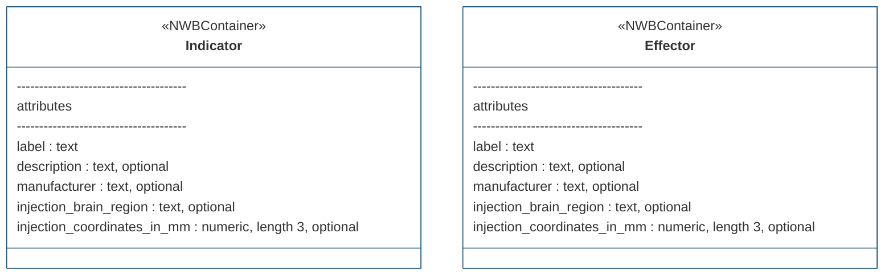
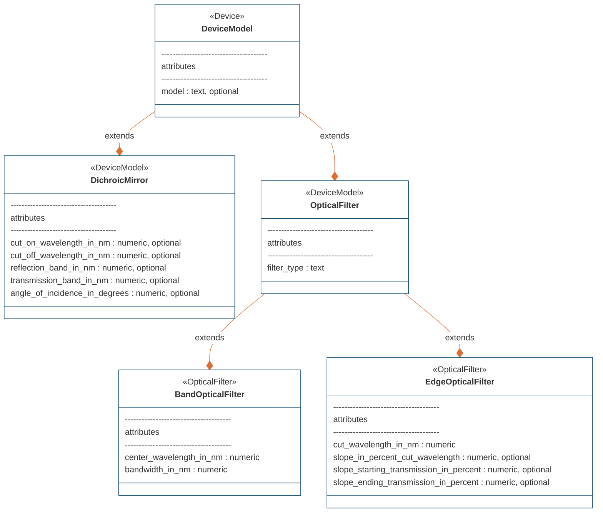
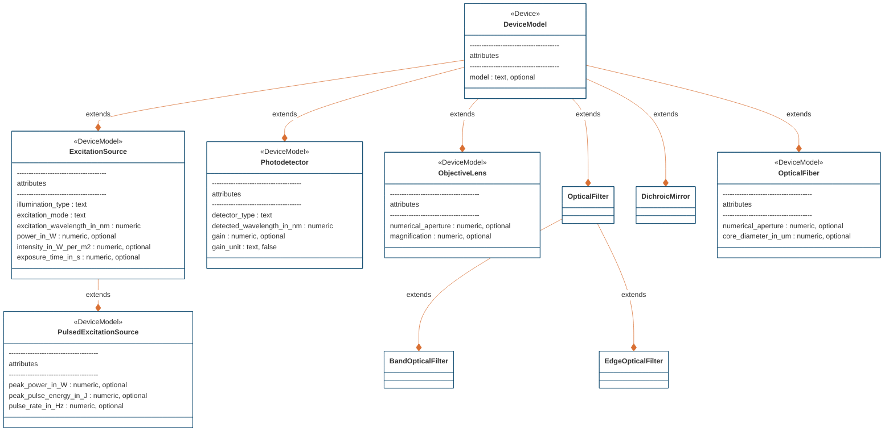

# ndx-ophys-devices Extension for NWB

This is an NWB extension for storing metadata of devices used in optical experimental setup (microscopy, fiber photometry, optogenetic stimulation etc.)

This extension consists of 11 new neurodata types:

DeviceModel extends Device to hold metadata on the model of the device. 
Indicator extends NWBContainer to hold metadata on the fluorescent indicator (ex. label=GCaMP6).
Effector extends NWBContainer to hold metadata on the effector/opsin (ex. label=hChR2).
OpticalFiber extends DeviceModel to hold metadata on the optical fiber (ex. numerical_aperture=0.39).
ExcitationSource extends DeviceModel to hold metadata on the excitation source (ex. excitation_wavelength_in_nm=470.0).
PulsedExcitationSource extends ExcitationSource to hold metadata on the pulsed excitation source (ex. pulse_rate_in_Hz=1000.0).
Photodetector extends DeviceModel to hold metadata on the photodetector (ex. detected_wavelength_in_nm=520.0).
DichroicMirror extends DeviceModel to hold metadata on the dichroic mirror (ex. cut_on_wavelength_in_nm=470.0).
OpticalFilter extends DeviceModel to hold metadata on a general optical filter (ex filter_type='Bandpass')
BandOpticalFilter extends OpticalFilter to hold metadata on any bandpass or bandstop optical filters (ex. center_wavelength_in_nm=505.0).
EdgeOpticalFilter extends OpticalFilter to hold metadata on any edge optical filters (ex. cut_wavelength_in_nm=585.0).
ObjectiveLens extends DeviceModel to hold metadata on the objective lens (ex magnification=60.0)

## Installation
To install the latest stable release through PyPI,
```bash
pip install ndx-ophys-devices
```

## Usage

```python
import datetime
import numpy as np
from pynwb import NWBFile
from ndx_ophys_devices import (
    Indicator,
    OpticalFiber,
    ExcitationSource,
    PulsedExcitationSource,
    Photodetector,
    DichroicMirror,
    BandOpticalFilter,
    EdgeOpticalFilter,
    ObjectiveLens,
    Effector,
    )

nwbfile = NWBFile(
    session_description='session_description',
    identifier='identifier',
    session_start_time=datetime.datetime.now(datetime.timezone.utc)
)

indicator = Indicator(
    name="indicator",
    description="Green indicator",
    label="GCamp6f",
    injection_brain_region="VTA",
    injection_coordinates_in_mm=(3.0, 2.0, 1.0),
)
effector = Effector(
    name="effector",
    description="Excitatory opsin",
    label="hChR2",
    injection_brain_region="VTA",
    injection_coordinates_in_mm=(3.0, 2.0, 1.0),
)

optical_fiber = OpticalFiber(
    name="optical_fiber",
    manufacturer="fiber manufacturer",
    model="fiber model",
    numerical_aperture=0.2,
    core_diameter_in_um=400.0,
)

objective_lens = ObjectiveLens(
    name="objective_lens",
    manufacturer="objective lens manufacturer",
    model="objective lens model",
    numerical_aperture=0.39,
    magnification=40.0,
)

excitation_source = ExcitationSource(
    name="excitation_source",
    description="excitation sources for green indicator",
    manufacturer="laser manufacturer",
    model="laser model",
    excitation_mode = "one-photon",
    illumination_type="laser",
    excitation_wavelength_in_nm=470.0,
    power_in_W= 0.7,
    intensity_in_W_per_m2= 0.005,
)
pulsed_excitation_source = PulsedExcitationSource(
    name="pulsed_excitation_source",
    description="pulsed excitation sources for red indicator",
    manufacturer="laser manufacturer",
    model="laser model",
    excitation_mode = "two-photon",
    illumination_type="laser",
    excitation_wavelength_in_nm=525.0,
    peak_power_in_W=0.7,
    peak_pulse_energy_in_J=0.7,
    intensity_in_W_per_m2=0.005,
    exposure_time_in_s=2.51e-13,
    pulse_rate_in_Hz=2.0e6,
)

photodetector = Photodetector(
    name="photodetector",
    description="photodetector for green emission",
    manufacturer="photodetector manufacturer",
    model="photodetector model",
    detector_type="PMT",
    detected_wavelength_in_nm=520.0,
    gain=100.0,
)

dichroic_mirror = DichroicMirror(
    name="dichroic_mirror",
    description="Dichroic mirror for green indicator",
    manufacturer="dichroic mirror manufacturer",
    model="dichroic mirror model",
    cut_on_wavelength_in_nm=470.0,
    transmission_band_in_nm=(460.0, 480.0),
    cut_off_wavelength_in_nm=500.0,
    reflection_band_in_nm=(490.0, 520.0),
    angle_of_incidence_in_degrees=45.0,
)

band_optical_filter = BandOpticalFilter(
    name="band_optical_filter",
    description="excitation filter for green indicator",
    manufacturer="filter manufacturer",
    model="filter model",
    center_wavelength_in_nm=480.0,
    bandwidth_in_nm=30.0, # 480±15nm
    filter_type="Bandpass",
)

edge_optical_filter = EdgeOpticalFilter(
    name="edge_optical_filter",
    description="emission filter for green indicator",
    model="emission filter model",
    cut_wavelength_in_nm=585.0,
    slope_in_percent_cut_wavelength=1.0,
    slope_starting_transmission_in_percent=10.0,
    slope_ending_transmission_in_percent=80.0,
    filter_type="Longpass",
)


nwbfile.add_lab_metadata(indicator)
nwbfile.add_lab_metadata(effector)
nwbfile.add_device(optical_fiber)
nwbfile.add_device(objective_lens)
nwbfile.add_device(excitation_source)
nwbfile.add_device(pulsed_excitation_source)
nwbfile.add_device(photodetector)
nwbfile.add_device(dichroic_mirror)
nwbfile.add_device(band_optical_filter)
nwbfile.add_device(edge_optical_filter)

```


## Entity relationship diagrams

#### Indicator and Effector


#### Optical Filters


#### Other devices in the optical setup



## Contributing

To help ensure a smooth Pull Request (PR) process, please always begin by raising an issue on the main repository so we can openly discuss any problems/additions before taking action.

The main branch of ndx-ophys-devices is protected; you cannot push to it directly. You must upload your changes by pushing a new branch, then submit your changes to the main branch via a Pull Request. This allows us to conduct automated testing of your contribution, and gives us a space for developers to discuss the contribution and request changes. If you decide to tackle an issue, please make yourself an assignee on the issue to communicate this to the team. Don’t worry - this does not commit you to solving this issue. It just lets others know who they should talk to about it.

From your local copy directory, use the following commands.

If you have not already, you will need to clone the repo:
```bash
$ git clone https://github.com/catalystneuro/ndx-ophys-devices
```

First create a new branch to work on
```bash
$ git checkout -b <new_branch>
```

Make your changes. Add new devices related to optical experiment setup or add more attributes on the existing ones. To speed up the process, you can write mock function (see _mock.py) that would be used to test the new neurodata type

We will automatically run tests to ensure that your contributions didn’t break anything and that they follow our style guide. You can speed up the testing cycle by running these tests locally on your own computer by calling pytest from the top-level directory.
Push your feature branch to origin (i.e. GitHub)

```bash
$ git push origin <new_branch>
```

Once you have tested and finalized your changes, create a pull request (PR) targeting dev as the base branch:
Ensure the PR description clearly describes the problem and solution.
Include the relevant issue number if applicable. TIP: Writing e.g. “fix #613” will automatically close issue #613 when this PR is merged.
Before submitting, please ensure that the code follows the standard coding style of the respective repository.
If you would like help with your contribution, or would like to communicate contributions that are not ready to merge, submit a PR where the title begins with “[WIP].”

Update the CHANGELOG.md regularly to document changes to the extension.

NOTE: Contributed branches will be removed by the development team after the merge is complete and should, hence, not be used after the pull request is complete.


---
This extension was created using [ndx-template](https://github.com/nwb-extensions/ndx-template).