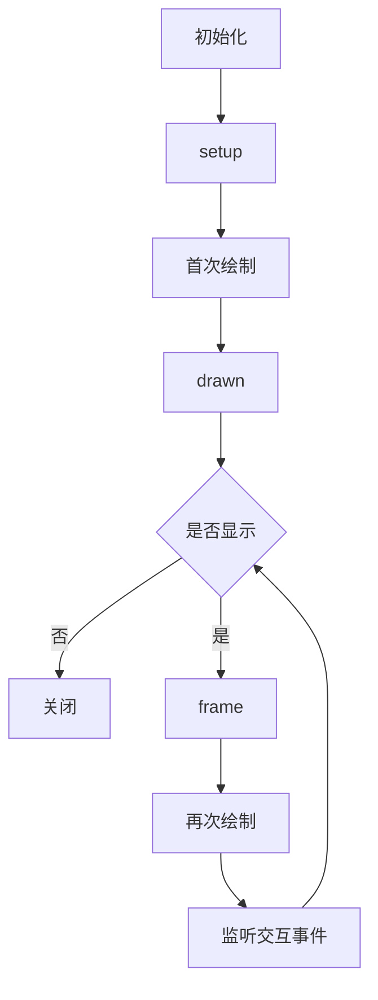

# PsychoPy-Scene

本项目是基于 [PsychoPy](https://github.com/psychopy/psychopy) 的轻量级绘制框架，**核心源码 <300 行**。

## 实验上下文

实验上下文 `Context` 表示实验的全局参数，包括环境参数、任务参数等。
编写实验的第一步，就是创建实验上下文。

```python
from exp import Context
from psychopy.visual import Window
from psychopy.monitors import Monitor
from psychopy.data import StairHandler

# create monitor
monitor = Monitor(
    name="testMonitor",
    width=52.65,
    distance=57,
)
monitor.setSizePix((1920, 1080))

# create window
win = Window(
    monitor=monitor,
    units="deg",
    fullscr=False,
    size=(800, 600),
)

# create experiment context
ctx = Context(
    win,
    handler=StairHandler(),
)
```

## 基本用法

实验任务可以被当作一系列画面 `Scene` 的组合，每个画面实现了 2 个功能：

- 绘制刺激：根据参数绘制若干个刺激。
- 处理交互：监听按键、鼠标点击等事件，并对这些事件进行处理。

> 接下来的示例将省略实验上下文的创建，直接展示如何编写任务。

画面采用链式调用（method chaining）模式进行配置。
`duraion` 方法设置持续时间，`close_on` 方法设置关闭画面的按键：

```python
from psychopy.visual import TextStim

# create stimulus
stim = TextStim(win, text="")
# create scene
scene = ctx.Scene().duration(1).close_on("f", 'j')
# show scene
scene.show()
```

对于静态刺激的绘制，我们可能只关心要绘制什么内容，而不需要逐帧更新刺激参数。
所以我们可以直接把需要绘制的刺激传入 `Scene` 方法中，这样刺激将被自动绘制：

```python
from psychopy.visual import TextStim

stim = TextStim(win, text="")
scene = ctx.Scene(stim)
scene.show()
```

通常我们需要在多个画面之间共享同一种刺激（文本），但是每个画面的内容又不同。
所以我们希望在画面首次绘制前设置刺激参数，而不是为每个画面都新建一个刺激。
这时，我们可以使用 `hook` 装饰器在 `setup` 阶段添加 [生命周期](#生命周期) 钩子，
被装饰的函数将在画面首次绘制前执行：

```python
from psychopy.visual import TextStim

stim = TextStim(win, text="")

# this is equivalent to:
# scene = ctx.Scene(stim).hook('setup')(lambda: stim.text = "Welcome to the experiment")
@(ctx.Scene(stim).hook('setup'))
def scene():
    stim.text = "Welcome to the experiment"

scene.show()
```

同样，如果我们需要逐帧改变刺激参数（绘制动态刺激），可以在 `frame` 阶段添加生命周期钩子：

```python
from psychopy import core
from psychopy.visual import TextStim

stim = TextStim(win, text="")

@(ctx.Scene(stim).hook('frame'))
def scene():
    stim.text = f"Current time is {core.getTime()}"

scene.show()
```

## 状态管理

大部分情况下，我们并不能一开始就决定刺激参数，而是需要在运行时根据条件动态地设置。
这时，我们可以将这类和画面绘制相关的动态数据作为画面的 **状态**：

```python
from psychopy.visual import TextStim

stim = TextStim(win, text="")

@(ctx.Scene(stim).duration(0.1).hook('setup'))
def scene():
    stim.text = scene.get("text") # get `text` state

for instensity in ['hello', 'world', 'goodbye']:
    scene.show(text=instensity) # set `text` state and show
```

需要注意的是，`show` 方法在其初始化阶段 **重置状态**，详见 [渲染时机](#渲染时机)。
所以，应该通过 `show` 设置初始状态，并在 `show` 执行后获取状态。

### 内置状态

有些状态是由画面配置方法自动设置的：

| 状态           | 描述             | 由哪个方法设置 |
| -------------- | ---------------- | -------------- |
| show_time      | 开始显示的时间戳 | show           |
| close_time     | 结束显示的时间戳 | show           |
| duration       | 持续时间         | duration       |
| keys           | 被按下的按键     | close_on       |
| responses_time | 按下按键的时间戳 | close_on       |

## 处理交互

画面使用发布/订阅模式（Pub/Sub Pattern）处理交互事件，我们可以通过添加事件监听器来处理不同的交互事件。

```python

# add listener for keys, listener will be executed when corresponding key is pressed
ctx.Scene().on(
    space=lambda e: print(f"space key was pressed, this event is: {e}"),
    mouse_left=lambda e: print(f"left mouse button was pressed, this event is: {e}"),
)
```

需要注意的是，一种事件只能有一个监听器。

```python
# only the last listener will be emitted when multiple listeners are added for the same key
ctx.Scene().on(
    space=lambda e: print("this listener won't be executed")
).on(
    space=lambda e: print("this listener will be executed")
)
```

## 数据收集

psychopy 推荐的实验数据收集方式是使用 `ExperimentHandler`，本库对其进行了简单封装。
现在我们可以使用 `ctx.addLine` 进行数据收集，并通过 `ctx.expHandler` 访问 `ExperimentHandler` 对象。

```python
# it will call `ctx.expHandler.addData` and `ctx.expHandler.nextEntry` automatically
ctx.addLine(correct=..., rt=...)
```

正如 [状态管理](#状态管理) 部分所说，交互数据是由 `close_on` 自动收集的。
如果我们使用了 `close_on` 方法，可以在 `show` 方法执行后访问这些状态。

```python
scene = ctx.Scene().close_on("f", "j")
scene.show()

keys = scene.get("keys") # KeyPress or str
responses_time = scene.get("responses_time") # float
```

当然，我们也可以像 [处理交互](#处理交互) 部分那样，手动添加监听器。

```python
scene = ctx.Scene().on(space=lambda e: scene.set(rt=core.getTime() - scene.get("show_time")))
scene.show()

rt = scene.get("rt") # float
```

## 生命周期

使用 `show` 方法将画面绘制到屏幕上时，需要经过一系列初始化步骤：
重置并初始化状态、清理事件缓冲、绘制刺激、记录开始显示时间等。
在这个过程中，同时会执行生命周期钩子，让我们在画面渲染的特定阶段进行一些自定义的操作。

如果我们想在首次绘制前更改刺激参数，可以使用 `hook` 装饰器在 `setup` 阶段添加生命周期钩子：

```python
from psychopy.visual import TextStim

stim = TextStim(win, text="")

@(ctx.Scene().hook('setup'))
def scene():
    # change stimulus parameters here
    stim.color = "red"

scene.show()
```

### 生命周期阶段：

| 阶段  | 执行时机   | 通常用法     |
| ----- | ---------- | ------------ |
| setup | 首次绘制前 | 设置刺激参数 |
| drawn | 首次绘制后 | 执行耗时任务 |
| frame | 逐帧       | 更新刺激参数 |

### 渲染时机

`show` 方法逻辑图示：



## 最佳实践

### 上下文和任务分离

建议以函数形式编写任务，并将实验上下文作为第一参数传入，其余参数作为任务的特有参数，并返回实验数据。

```python
from exp import Context

def task(ctx: Context, duration: float):
    from psychopy.visual import TextStim

    stim = TextStim(ctx.win, text="")
    scene = ctx.Scene(stim).duration(duration)
    scene.show()
    return ctx.expHandler.getAllEntries()
```

### 只关注特定于任务的逻辑

任务函数不应包含任何与任务本身无关的逻辑，例如：

- 指导语和结束语
- block 数量
- 数据处理、分析、结果展示

一个好的任务函数应该只呈现一个 block，除非 block 间存在数据依赖。
对于需要呈现多个 block 的实验，考虑以下示例。

```python
from exp import Context
from psychopy.visual import Window

def task(ctx: Context):
    from psychopy.visual import TextStim

    stim = TextStim(ctx.win, text="")
    scene = ctx.Scene(stim).duration(0.2)
    scene.show()
    return ctx.expHandler.getAllEntries()

ctx = Context(Window())
data = []
for block_index in range(10):
    block_data = task(ctx)
    data.extends(block_data)
```

### trial 迭代器和任务分离

得益于 psychopy 对 trial 的封装，我们可以很方便地控制下一个 trial。

```python
from psychopy.data import TrialHandler

handler = TrialHandler(trialsList=['A', 'B', 'C'], nReps=1, nTrials=10)
for trial in handler:
    trial # except: 'A" or 'B' or 'C'
```

为了 trial 迭代器和任务函数的分离，本库提供了 `ctx.handler` 属性，
它可以用来控制下一个 trial，并将 trial 相关的数据收集到 `ctx.expHandler` 中。
我们只需要在创建上下文时设置 `handler` 参数即可。

```python
from exp import Context
from psychopy.visual import Window
from psychopy.data import TrialHandler

def task(ctx: Context):
    from psychopy.visual import TextStim

    stim = TextStim(ctx.win, text="")
    @(ctx.Scene(stim).duration(0.2).hook('setup'))
    def scene():
        stim.text = scene.get("text")
    for instensity in ctx.handler:
        scene.show(text=instensity)
    return ctx.expHandler.getAllEntries()

ctx = Context(
    Window(),
    handler=TrialHandler(trialsList=['A', 'B', 'C'], nReps=1, nTrials=10),
)
data = task(ctx)
```

但是，当我们打算使用 `StairHandler` 并访问 `ctx.handler.addResponse` 时，
pylance 类型检查器会报错，即使 `ctx.handler` 是 `StairHandler` 对象。
这是因为 `ctx.handler` 的类型并没有 `addResponse` 方法，
为了解决这个问题，我们可以使用 `ctx.responseHandler` 替代 `ctx.handler`。

需要注意的是，如果在运行时 `ctx.handler` 没有 `addResponse` 方法，
访问 `ctx.responseHandler` 将会抛出异常。
所以在使用 `ctx.responseHandler` 时，请确保传入的 `handler` 参数有 `addResponse` 方法。
