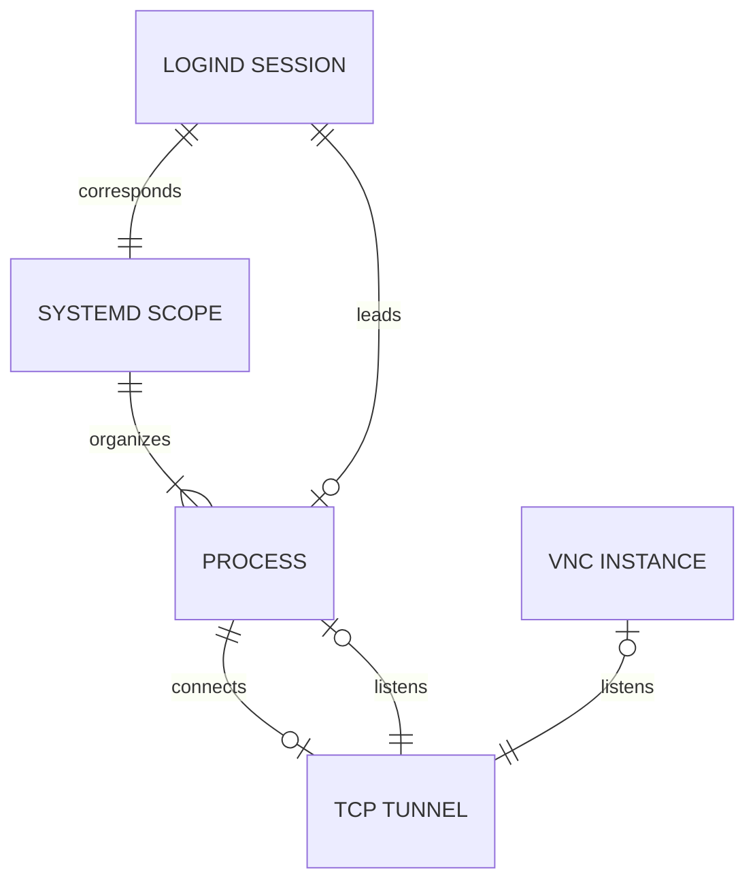

# stop-idle-sessions

Stop idle `systemd-logind` sessions to prevent interactive access from
unattended terminals. E.g., a laptop left unlocked in a coffee shop, with an
SSH session into an internal network resource.

## Background

NIST Special Publication 800-53 "Security and Privacy Controls for Information
Systems and Organizations" includes a broadly-worded control, [SC-10 "Network
Disconnect,"](https://csf.tools/reference/nist-sp-800-53/r5/sc/sc-10/) which
requires:

> Terminate the network connection associated with a communications session at
> the end of the session or after [Assignment: organization-defined time period]
> of inactivity. Network disconnect applies to internal and external networks.
> Terminating network connections associated with specific communications
> sessions includes de-allocating TCP/IP address or port pairs at the operating
> system level and de-allocating the networking assignments at the application
> level if multiple application sessions are using a single operating
> system-level network connection. Periods of inactivity may be established by
> organizations and include time periods by type of network access or for
> specific network accesses.

The OpenSSH software provides a general-purpose tool for accessing remote
systems. It includes functionality for remote terminal emulation, execution of
remote commands, tunneling of TCP sessions (e.g., for remote desktop access
with Xvnc), and file copying. This software package intends to address
`systemd-logind` sessions -- mostly OpenSSH sessions -- as a prime vector for
"communications session[s]" and to "de-allocate [OpenSSH] networking
assignments" after "[established] periods of activity."

## Configuration

The application should be run by means of the following command, on a timer
(either via SystemD or cron):

    /usr/libexec/platform-python -m stop_idle_sessions.main --syslog

The purpose of using `/usr/libexec/platform-python` rather than
`/usr/bin/python3` is to ensure that the base OS version of Python is selected
(i.e., the one which hosts the distro-provided `python3-*` packages) and NOT an
alternative via `/etc/alternatives`.

The location to a configuration may be specified with `-c` or simply by using
the default location, `/etc/stop-idle-sessions.conf`. It may contain the
following contents to control execution:

    # Configuration for stop-idle-sessions. See the README:
    # https://github.com/liverwust/stop-idle-sessions/README.md
    #
    
    [stop-idle-sessions]
    
    # Threshold for termination of idle sessions, specified in minutes.
    timeout = 15
    
    # Set to a comma-separated list of users (default empty) to identify users
    # whose sessions should not be affected by session termination.
    #excluded-users = root, someone, serviceacct
    
    # Override to 'yes' (default 'no') to prevent stop-idle-sessions from
    # actually taking action. Instead, it will simply log the actions that it
    # would take.
    #dry-run = yes
    
    # Override to 'yes' (default 'no') to force logging to syslog, even when
    # run from the command-line. The SystemD unit will run the program with
    # --syslog and so this option is probably not necessary.
    #syslog = yes

    # In the event that --syslog is provided (or syslog = yes is set), AND the
    # --verbose flag is provided (or verbose = yes is set), then this option
    # can be used to write out debugging information to a file at the given
    # location. This is useful because the LOG_USER facility may not write
    # less-important messages otherwise. This option is left blank by default,
    # which means that no file is used for this purpose.
    #debug-log = /var/log/stop-idle-sessions.log
    
    # Override to 'yes' (default 'no') to trigger debug logging, which will
    # print diagnostic messages every time that the application is run.
    #verbose = yes 

Although the timeout is specified, it is still necessary to set up a recurring
SystemD timer or cronjob to run the app. _It will not run itself._

## Runtime Behavior

By design, this `stop-idle-sessions` package is _stateless_. It is not intended
to run as a daemon. Instead, it should be configured as a SystemD
[one-shot service](https://www.man7.org/linux/man-pages/man5/systemd.service.5.html#OPTIONS)
(with a corresponding
[.timer unit](https://www.man7.org/linux/man-pages/man5/systemd.timer.5.html)).
Alternatively, it can be run as a cronjob.



Each time it runs, the `stop-idle-sessions` package builds a relational
representation of system elements similar to the preceding diagram. For each
`systemd-logind` session meeting certain criteria, it then calculates an
"idleness" metric. This "idleness" is subject to configurable limits for
warning and termination.

### Session Leaders

The concept of a **Session Leader** is critical to the design of this software
package. The `Leader` attribute of a [`systemd-logind` Session
object](https://www.freedesktop.org/software/systemd/man/latest/org.freedesktop.login1.html#Properties3)
is defined simply as "the PID of the process that registered the session."
There is a lot of significance hiding behind this simple definition.

Every Session Leader can be described as follows: it is a privileged process
(run as root) which has initiated an authentication workflow via Pluggable
Authentication Modules (PAM) on behalf of a user. More specifically, the
[`pam_systemd` module](https://www.man7.org/linux/man-pages/man8/pam_systemd.8.html)
provides the _only mechanism_ by which a `systemd-login` session may be
registered.

Here are a few common examples of Session Leader:

* `/usr/libexec/gdm-session-worker` for local (GDM) graphical logins
* `/usr/bin/login` for local text-based logins
* `/usr/sbin/vncsession` for SystemD-mediated VNC sessions (Note: running
  `vncserver -localhost` from the command-line does NOT create a separate
  `systemd-logind` session)
* `/usr/sbin/sshd`, specifically the fork which shows up as `sshd: username
  [priv]` in the process table

All Session Leaders have something else in common: they are the singular
conduit through which users may continue to interact with their session. When
`stop-idle-sessions` needs to disconnect an idle user, it does so specifically
by terminating a Session Leader process.

### Ineligible Sessions

Not every `systemd-logind` session is checked for idleness. The following types
of session are **exempt** from the idleness computation and will not be
terminated by `stop-idle-sessions` enforcement:

* **Graphical sessions.** Both local (GDM) and remote (VNC) sessions are
  exempted from idleness computation and enforcement. Such environments have
  their own ways to protect idle sessions (e.g., screensavers). They aren't
  necessarily _ignored_ --- as
  [explained later](#idleness-calculation-for-eligible-sessions), they might be
  referenced when computing idleness of _other_ sessions --- but they
  themselves are not subject to any scrutiny by `stop-idle-sessions`.

  **Note:** interestingly, running a `vncserver -localhost` command does NOT
  launch a proper graphical session. An Xvnc instance will run inside of the
  original (SSH) session. Remember that only root can spawn [Session
  Leaders](#session-leaders). This isn't a problem --- see the [later
  section](#idleness-calculation-for-eligible-sessions) which explains how
  these sessions are handled.

* **`systemd-logind` sessions without an assigned teletype (TTY) or
  pseudo-teletype (PTY) device.** These can be started by, for instance,
  `ssh -T remote-host.remote-domain.com`. Typically these are established by
  programs that are driving a remote system programmatically
  / noninteractively, and which only need to interact with the remote system
  thru CLI primitives. For example, Visual Studio Code Remoting will establish
  this kind of SSH session. Because these "sessions" are noninteractive, there
  is limited "walk-up" risk and they are therefore not subject to termination.

* **`systemd-logind` sessions belonging to excluded users.** If configured to
  do so, `stop-idle-sessions` will ignore any session associated with a list of
  named user accounts. All SSH sessions associated with these users, even
  interactive ones (= with an assigned PTY), will be allowed to remain idle
  indefinitely.

* **Any `systemd-logind` session whose [Session Leader](#session-leaders) has
  been terminated.** The preceding section explains the significance of Session
  Leaders. Things get even more interesting _after_ a Session Leader has exited
  or been terminated.

  Each `systemd-logind` session also employs a `systemd.scope` (a concept
  related to cgroups) under the hood. Although the `systemd-logind` session
  tracks a Process Leader, a `systemd.scope` is specifically designed NOT to
  treat any process specially.
  [The manpage](https://www.man7.org/linux/man-pages/man5/systemd.scope.5.html)
  specifically states "all processes in the scope are equivalent. The lifecycle
  of the scope unit is thus not bound to the lifetime of one specific process."

  When the Leader exits or is terminated, both the `systemd-logind` session and
  `systemd.scope` continue to exist. The scope is essentially unchanged, but
  the session undergoes three observable changes:

    * Its `Leader` attribute is reset to 0
    * Its `State` is demoted from `active` to `closing` (where it may remain
      _indefinitely_ until the entire `systemd.scope` has gone away)
    * Its `TTY` value, if it had one, will remain unchanged BUT is no longer
      trustworthy (i.e., it may claim `pts/N`, even if that device has
      automatically disappeared or been reassigned to another session)

  Although confusing, `stop-idle-sessions` considers this behavior to be quite
  useful. The [Session Leader](#session-leaders) concept basically guarantees
  that a user (or an attacker) cannot "interact" with the system unless they do
  so thru the "conduit" provided by a Session Leader. Consider the following
  sample workflow with some made-up session identifiers:

    1. User connects via SSH.
    2. `systemd-logind` session ID=121 is established by its Session Leader,
       which is an instance of `sshd [priv]`
    3. User starts a TMUX session inside of this session (and scope).
    4. After a while, `stop-idle-sessions` terminates the `sshd [priv]` Session
       Leader process.
    5. _From the User's perspective:_ The SSH connection established is
       immediately disconnected.
    6. _From the Session's perspective:_ `systemd-logind` session ID=121
       undergoes the described changes. It is orphaned/separated from its
       original Session Leader. **Importantly:** processes other than the
       Session Leader continue to run, including TMUX.
    7. User connects again via SSH.
    8. `systemd-logind` session ID=122 is established by its Session Leader,
       which is a new instance of `sshd [priv]`.
    9. User re-attaches to the TMUX session, which is still running in the
       _old_ session and scope.

  The key point here is that the user --- or an attacker sitting behind them in
  the coffee shop --- _cannot_ interact with the TMUX (or any other process)
  in-between steps 5 and 7. Or to put it another way, all of the user's
  **interactions** are "gated" by the existence of an interactive
  `systemd-logind` session (thru a Leader), but there is no limit on their
  ability to run **processes** (e.g., TMUX or VNC) in the background
  indefinitely.

### Idleness Calculation for Eligible Sessions

After setting aside the various ineligible sessions, `stop-idle-sessions` needs
to calculate an idleness metric for each of the remaining `systemd-logind`
sessions. Depending on the nature of the session and the processes running
inside of it, this information can come from multiple places.

In the context of a non-graphical session, it is obvious that a user's
keystrokes should be counted as "activity" on the user's part. To borrow
wording from the STIG control: it is nearly certain that a console session
which is registering keystrokes has not been *left unattended*. Similarly,
a program which is actively generating new output (such as a compiler or
a shell loop) should also reset the idle timer. This information is encoded on
the access time (atime) and modification time (mtime) on the teletype (TTY) or
pseudo-teletype (PTY) device associated with that session.

Interestingly, the following patterns can be observed empirically — e.g., by
running `man 1 inotifywatch` against a tty or pty:

| Event          | Updates `mtime`? | Updates `atime`? |
|----------------|------------------|------------------|
| Keyboard input | Yes              | Yes              |
| Program output | Yes              | **No**           |

`stop-idle-sessions` will look for the later of the two times, giving the user
the benefit of the doubt when it comes to usage patterns which involve
continuous output but little or no keyboard input.

Note that programs which are displaying static output will NOT touch the
`mtime` and will therefore not be successful at extending the idle timeout. For
instance, a console session which is displaying a manpage for longer than the
threshold will be terminated at the timeout interval.

#### Attribution of Tunneled Graphical Sessions

[OpenSSH provides various forwarding features](https://www.openssh.com/features.html),
which can be used to instruct the server to "tunnel" traffic to/from remote
locations on behalf of the client. This means that a console session's
continued existence might affect more than just the interactive terminal
session itself.

A key feature of `stop-idle-sessions` is the ability to trace through these
established tunnels to find a local Virtual Network Computing (VNC) service. If
it finds one, it can further trace the idleness status of that VNC service by
using information provided by the
[X11 Screen Saver Extension](https://www.x.org/releases/X11R7.7/doc/scrnsaverproto/saver.html).

In doing so, the idle-or-not-idle status of the VNC session is propagated to
the SSH session. So long as a user continues to generate regular input events
(e.g., mouse movement), their tunneled SSH session will also be considered
active by `stop-idle-sessions`.

## Alternatives

The `stop-idle-sessions` package aims to be cohesive and reliable, but it is
definitely not a "native" way to accomplish SC-10 compliance. There are at
least three major alternatives which any security-conscious team should
consider before choosing this solution. These alternatives were not sufficient
in our case, but they are probably easier to implement and less likely to break
in the future.

### TMOUT / autologout

The simplest possible way to terminate an idle non-graphical session is to
[set the TMOUT shell variable (POSIX shells)](https://www.gnu.org/software/bash/manual/html_node/Bash-Variables.html#index-TMOUT)
and the
[autologout shell variable (C shells like tcsh)](https://linux.die.net/man/1/tcsh).

However, this has a few downsides:

* POSIX shells offer the `readonly` keyword to lock down the TMOUT setting, but
  this can be bypassed with a bit of Googling. This creates a disparity between
  users who know how to bypass the control (plus everyone they tell) vs. those
  who do not.

* C shell doesn't even have the `readonly` keyword and so the `autologout`
  setting is trivially overridden.

* The `TMOUT` and `autologout` timeouts only occur at the shell prompt. So, for
  example, a `vim` or `cat` session will linger indefinitely even if not
  producing any new output.

* These settings are not sensitive to the existence of tunneled VNC traffic and
  will terminate such a tunnel without checking for graphical session idleness.

### ChannelTimeout

Newer versions of OpenSSH provide a
[ChannelTimeout setting](https://man.openbsd.org/sshd_config#ChannelTimeout)
which is much more easily-audited than the `TMOUT` settings. This setting will
likely be featured in upcoming revisions of the NIST and DISA STIG control
sets. However, this new version (9.2) is not available in either Red Hat
Enterprise Linux (RHEL) major version 8 or 9.

### StopIdleSessionSec

[NIST S.P. 800-53](#background) is not the only U.S. federal government
standard which considers this attack vector. The Defense Information Systems
Agency (DISA) Security Technical Implementation Guide (STIG) for Red Hat
Enterprise Linux (RHEL) 8 includes the following technical control:

[V-257258: Terminating an idle session within a short time period reduces the
window of opportunity for unauthorized personnel to take control of
a management session enabled on the console or console port that has been left
unattended.](https://www.stigviewer.com/stig/red_hat_enterprise_linux_8/2023-09-11/finding/V-257258)

The implementation which is prescribed for this technical control is as follows:

```bash
# Verify that RHEL 8 logs out sessions that are idle for 15 minutes with the following command:
$ sudo grep -i ^StopIdleSessionSec /etc/systemd/logind.conf
StopIdleSessionSec=900
# If "StopIdleSessionSec" is not configured to "900" seconds, this is a finding. 
```

This has the major benefit of being built-into SystemD and `systemd-logind`.
However, there are a few notable downsides:

* This setting affects _all_ `systemd-logind` sessions, including graphical
  sessions. There is even a
  [known bug in RHEL8](https://access.redhat.com/solutions/7061354)
  where it terminates the GDM login screen after that becomes "idle" (though
  this will eventually be fixed). Our team wanted to allow persistent graphical
  sessions while continuing to rely on screen-lock and/or SSH tunnel
  termination (for VNC) to protect these sessions.

* For a non-graphical session, such as one launched from the local console or
  from SSH, the [StopIdleSessionSec
  setting](https://www.freedesktop.org/software/systemd/man/latest/logind.conf.html#StopIdleSessionSec=)
  (`man 5 logind.conf`) only consults the `atime` (access time) of the tty or
  pty device to determine idleness. If the `atime` is older than the specified
  threshold, then the session is terminated. As described in the
  [idleness calculation section](#idleness-calculation-for-eligible-sessions),
  active program output _does not update_ the `atime` --- only user input
  (keystrokes) can update the `atime`. In our case, we wanted to avoid
  terminating long-running processes like compilers and shell loops, and so the
  solution needed to respect _both_ `mtime` and `atime`.

* This implementation terminates an _entire_ session by terminating each
  individual process associated with the `systemd.scope`. This is a reasonable
  implementation which cleans up the `State=closing` sessions that would
  otherwise be left behind by terminating just the [Sesssion
  Leader](#session-leaders). However, for
  [the reasons described above (4th bullet)](#ineligible-sessions),
  our team actually considers these lingering sessions to be useful for
  allowing users to continue running persistent processes.
